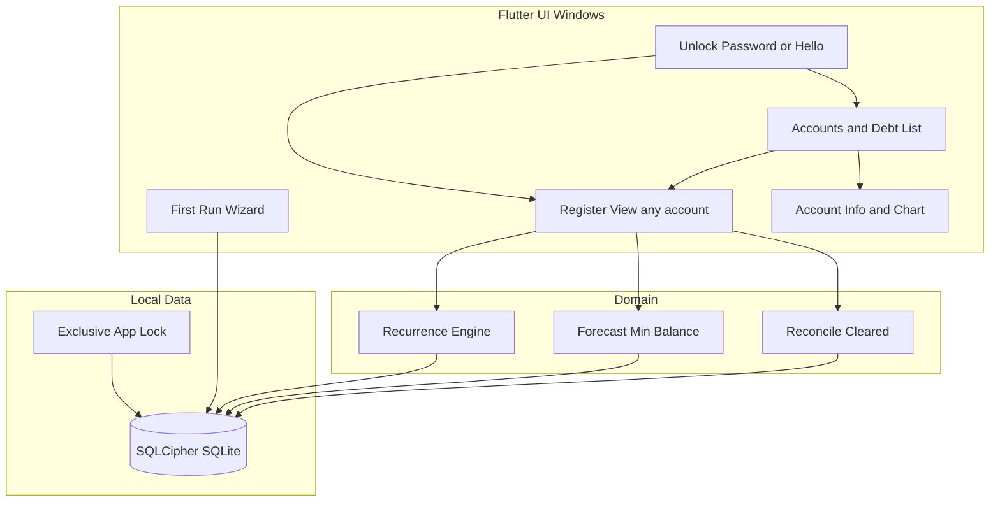
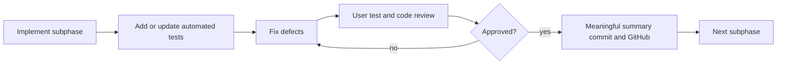

# Cash Flow Manager — Requirements & Phased Plan

> Canonical project plan. Approved 2026-07-23. Living feature checklist: [`FEATURES.md`](FEATURES.md) (added in Phase 0.1).

## Approval status

**Approved** — 2026-07-23. Requirements and phased plan locked. Execution begins at **Phase 0.1** (commit plan into repo, then Flutter Windows scaffold).

## Product intent

Replace spreadsheet cash tracking with a local-first **bank register + short-horizon cash forecast**. Every account has a full ledger/register. The **primary checking** account opens in Register view by default; other accounts open the same Register when selected. Forecasting metrics (4/8-week trough) apply to the **primary** account by default (can show for any account later if useful).

## Unified ledger — work tradeoff

**Same or less work overall — recommend unified ledgers.**

| Approach | Cost |
|----------|------|
| Split model (checking register + sparse “adjustments” on others) | Two UIs, two write paths, two balance rules, migration pain if you later want a card register |
| **Unified ledger (chosen)** | One `transactions` table, one Register screen, one running-balance/reconcile path; accounts differ by `type` / flags only |

v1 UI work is slightly broader (register is account-scoped), but you avoid a second ledger design and Phase 4 “monthly adjustments” become normal register rows (interest, payment, credit). You can still choose not to add recurrence/forecast noise on debt accounts — just don’t create rules there.

**UX default:** after unlock → Register for `is_primary = 1` checking. Account list / debt list → “Open register” on any account.

## Confirmed decisions

- **Stack:** Flutter (Windows first, Android later)
- **Ledger:** All accounts share the same register features
- **Primary:** One main checking; default open target; default forecast target
- **Debt/cards:** No bank import; user enters debits/credits/interest in that account’s register when balancing
- **Storage:** User-selectable SQLCipher SQLite path (e.g. OneDrive)
- **Security:** Whole-DB encryption; app password + Windows Hello
- **First run:** Setup wizard (minimum questions → usable primary account)
- **Distribution:** Windows exe/MSIX (MSI if needed); Android deferred
- **Process:** Small subphases; tests after each change; you review; on approval → meaningful commit/PR to GitHub; then next subphase

## Architecture (v1)



**Stack pieces**

- Flutter + Material 3, sci-fi / dark-tech theme (cool neutrals, restrained cyan/teal)
- SQLCipher (`sqflite_sqlcipher` or equivalent maintained binding)
- Schema migrations via `schema_version`
- Windows packaging in Phase 5 (`msix` / Inno / WiX as needed)
- Windows Hello + Credential Manager / DPAPI for key unwrap

## Encryption

**Encrypt the whole database (SQLCipher).** Simpler and stronger than field-level encryption for account numbers and login fields. Password derives/wraps the DB key; Hello unlocks the wrapped key; session clears key on lock/exit.

## OneDrive / single-writer

- Exclusive lock file beside DB; one read/write opener
- Prefer `journal_mode=DELETE` on sync folders (avoid WAL `-shm` issues)
- Assume OneDrive synced before open (stronger sync checks later)
- Stale lock warning + cautious force-unlock

## Database schema (v1)

All monetary amounts stored as **integer cents** (or fixed minor units) to avoid float drift. Timestamps ISO-8601 UTC text unless noted.

```sql
-- meta
schema_version(version INTEGER NOT NULL);

app_settings(
  key TEXT PRIMARY KEY,
  value TEXT NOT NULL
);
-- keys e.g. forecast_horizon_days, lock_timeout_minutes, primary_account_id (denorm ok)

accounts(
  id TEXT PRIMARY KEY,              -- UUID
  name TEXT NOT NULL,
  type TEXT NOT NULL,              -- checking | savings | income | loan | credit_card | utility | other
  institution TEXT,
  account_number TEXT,              -- protected by DB encryption
  login_url TEXT,
  login_username TEXT,
  login_password TEXT,              -- protected by DB encryption
  contact_name TEXT,
  contact_phone TEXT,
  contact_email TEXT,
  notes TEXT,
  interest_rate_apr REAL,           -- e.g. 19.99 = 19.99%
  minimum_payment_cents INTEGER,
  payment_due_day INTEGER,          -- 1-31 nullable
  currency_code TEXT NOT NULL DEFAULT 'USD',
  is_primary INTEGER NOT NULL DEFAULT 0,  -- exactly one checking primary
  is_archived INTEGER NOT NULL DEFAULT 0,
  include_in_debt_list INTEGER NOT NULL DEFAULT 0, -- 1 for loan/credit_card/etc.
  opening_balance_cents INTEGER NOT NULL DEFAULT 0,
  opening_date TEXT NOT NULL,       -- date
  created_at TEXT NOT NULL,
  updated_at TEXT NOT NULL
);

recurrence_rules(
  id TEXT PRIMARY KEY,
  account_id TEXT NOT NULL REFERENCES accounts(id),  -- register that receives generated rows
  linked_account_id TEXT REFERENCES accounts(id),     -- optional: income/debt this represents
  payee TEXT NOT NULL,
  memo TEXT,
  amount_cents INTEGER NOT NULL,    -- sign convention: + inflow, - outflow for that register
  frequency TEXT NOT NULL,          -- daily|weekly|biweekly|semimonthly|monthly|quarterly|yearly
  interval INTEGER NOT NULL DEFAULT 1,
  anchor_date TEXT NOT NULL,        -- first occurrence date
  next_scheduled_date TEXT,
  end_date TEXT,
  auto_clear INTEGER NOT NULL DEFAULT 0,
  is_active INTEGER NOT NULL DEFAULT 1,
  created_at TEXT NOT NULL,
  updated_at TEXT NOT NULL
);

transactions(
  id TEXT PRIMARY KEY,
  account_id TEXT NOT NULL REFERENCES accounts(id),
  date TEXT NOT NULL,               -- business date
  post_date TEXT,                   -- optional
  payee TEXT,
  memo TEXT,
  amount_cents INTEGER NOT NULL,    -- + in, - out for that account's register
  is_cleared INTEGER NOT NULL DEFAULT 0,
  cleared_at TEXT,
  source TEXT NOT NULL,             -- manual | recurring_generated | manual_future | opening_balance
  recurrence_rule_id TEXT REFERENCES recurrence_rules(id),
  recurrence_instance_key TEXT,     -- e.g. ruleId:YYYY-MM-DD for idempotent generation
  is_user_overridden INTEGER NOT NULL DEFAULT 0,
  transfer_pair_id TEXT,            -- future: link two legs
  interest_cents INTEGER,           -- optional portion tagged as interest (charts)
  principal_cents INTEGER,          -- optional portion tagged as principal
  created_at TEXT NOT NULL,
  updated_at TEXT NOT NULL,
  UNIQUE(account_id, recurrence_instance_key)
);

-- Optional helper for charts / payoff (can be computed from transactions; table only if caching needed)
-- balance_snapshots deferred; derive from transactions for v1

-- Schema v2: append-only activity / audit trail (access + data changes)
audit_log(
  id TEXT PRIMARY KEY,
  at TEXT NOT NULL,                 -- ISO-8601 UTC
  category TEXT NOT NULL,           -- access | account | transaction | settings | system
  action TEXT NOT NULL,             -- unlock_password | unlock_hello | unlock_failed | lock |
                                    -- force_unlock | create_vault | create | update | delete | clear | etc.
  entity_type TEXT,                 -- account | transaction | recurrence_rule | vault | null
  entity_id TEXT,
  summary TEXT NOT NULL,            -- short human-readable line
  detail_json TEXT,                 -- optional before/after or context (no raw passwords)
  machine_name TEXT,
  app_version TEXT
);

lock_meta is NOT in DB — filesystem .cfm.lock beside the db file.
```

**Running balance:** computed in query/UI from `opening_balance` + ordered transactions (not stored per row in v1, unless performance requires a cached column later).

**Sign convention:** each register is account-centric (payment on a credit card register reduces balance owed — document UI so “payment” is intuitive per account type).

**Indexes:** `(account_id, date, id)`, `(account_id, is_cleared)`, `(recurrence_rule_id)`, `audit_log(at)`, `audit_log(category, at)`.

**Audit log rules:** append-only (no user edit/delete in v1); never store plaintext passwords or DB keys; failed unlocks logged without the attempted password; Settings provides a read-only Activity log viewer (Phase 5.1).

## First-time setup wizard

Minimum path to a usable app (no empty shell):

1. **Welcome** — short purpose
2. **Database location** — create/select folder/file path
3. **Security** — set app password; offer enable Windows Hello
4. **Primary checking** — name, institution (optional), opening balance, opening date
5. **Done** — create encrypted DB + primary account + opening_balance transaction; land on Register

Optional skip-friendly step (same wizard or later): add first income or debt account. Not required to finish.

## UI surfaces (v1)

1. Setup wizard (first run only)
2. Unlock (password / Hello)
3. **Register view** (default = primary checking) — sticky header: column labels + reconciled balance, today’s balance, lowest in 4 weeks, lowest in 8 weeks; color-coded rows
4. Accounts list + **Debt list** (balance, APR, payment)
5. Account info panel (metadata, credentials, 12-month chart) — register opened via action/default navigation
6. Settings — DB path display, horizon, lock timeout, change password, Hello, backup

**Row colors:** past uncleared | cleared | auto-generated future | manual future

## UI / look-and-feel — when to change it

Flutter is the **framework** (widgets, Windows desktop, test hooks). Look-and-feel lives in our **theme + screen layouts**, not in “picking a different framework.” If the sci-fi / modern direction is wrong, we restyle and re-layout in Flutter — we do **not** need to switch stacks.

**Where the code lives (once scaffolded)**

- Global look: `lib/theme/` (colors, typography, densities) — change once, affects all screens
- Shell / nav: `lib/app_shell/` (or similar)
- Per screen: `lib/features/<feature>/` (register, accounts, wizard, unlock)
- Shared widgets: `lib/widgets/` (register row, metric header chips, etc.)

**When to review and modify (allocated windows)**

| Window | Phase | What you judge | What we change |
|--------|-------|----------------|----------------|
| **Direction gate** | **0.2** (+ short **0.2b** if needed) | Colors, type, chrome, “does this feel sci-fi/modern or wrong?” | Theme tokens, fonts, shell only — before deep feature work |
| **Structure gate** | **1.2–1.3**, **2.4–2.5** | Lists, account info, register density, sticky header usefulness | Layout of lists + register; still cheap |
| **Forecast visuals gate** | **3.3** | Future/cleared/manual row colors; header metrics readability | Row styling + header presentation |
| **Charts / polish gate** | **4.2**, **5.1** | Chart style, empty states, motion, final polish | Charts, micro-interactions, copy |

**Rules**

- **Prefer early:** reject or redirect the theme at **0.2** so we don’t build five screens on the wrong aesthetic
- **Expected mid-course UI tweaks:** after you use the real Register (**Phase 2**), feedback like denser rows, different header metrics layout, or alternate color coding is normal — schedule as a small UI subphase (e.g. **2.6 UI pass**) rather than waiting for Phase 5
- **Phase 5 is final polish**, not the first time you see the UI — don’t save all visual feedback for the end
- **Framework mismatch vs taste mismatch:** “buttons feel wrong / not sci-fi enough” → theme/layout pass in the gates above. “Flutter desktop can’t do X we need” → rare; raise immediately and we plan a targeted workaround (still usually stay on Flutter)
- UI-only subphases still follow the same loop: implement → widget tests for the contract → your review → approve → GitHub

**Optional dedicated UI subphases (insert when you request a look change)**

- **0.2b** Theme revision (after you react to 0.2)
- **2.6** Register UI pass (density, header, columns)
- **3.6** Forecast color / metrics presentation pass
- **5.1** already covers final visual polish

## Recurrence & forecast

- Materialize ~2 months of uncleared future instances per active rule into `transactions`
- Editable until cleared; cleared rows protected (unclear to edit)
- Frequencies: daily, weekly, biweekly, semimonthly, monthly, quarterly, yearly
- Forecast trough from primary account register by default

## Development group rules (process)

These govern how we implement — not optional polish.

### Feature & progress tracking

- Maintain [`docs/FEATURES.md`](docs/FEATURES.md) (or equivalent) as the living checklist: feature id, phase/subphase, status (`planned` / `in_progress` / `done` / `blocked`), test coverage ref
- Each subphase updates that tracker before handoff
- Plan todos stay aligned with phases; subphases listed below are the work units

### Subphase delivery loop (strict)



1. Agent implements **one subphase only** (small diff)
2. Agent adds/updates **automated tests** for that change and runs the suite (fix failures before handoff)
3. User tests manually + reviews code; requests changes or logs defects
4. On **explicit approval**, agent writes a meaningful summary and **commits / opens or updates PR on GitHub** (no commit until you approve)
5. Only then start the next subphase

### Testing strategy (Flutter equivalent of “keep Playwright scripts”)

Playwright targets web browsers; this is a Flutter desktop app. Same intent — **durable, re-runnable regression suite in-repo**:

| Layer | Tool | What |
|-------|------|------|
| Unit | `flutter test` | Domain: recurrence, running balance, trough, sign rules, migrations |
| Widget | `flutter test` | Register header, row colors, wizard steps, debt list |
| Integration / e2e | `integration_test` (Windows) | Unlock → open register → add/clear tx; wizard happy path |

- Tests live under `test/` and `integration_test/`; named by feature (e.g. `recurrence_engine_test.dart`)
- **Rule:** no subphase handoff without new/updated tests for that feature + green run
- Prefer testing domain logic without UI where possible; widget/e2e for GUI contracts
- SQLCipher tests use temp DB files + test password fixtures

### Coding standards (lightweight)

- Small PRs per subphase; meaningful commit messages (why)
- No drive-by refactors outside the subphase
- GPL-3.0-compatible dependencies only
- Secrets never logged; test DBs use fake credentials

### Additional process defaults (adopted)

**Git / handoff**

- Branch per subphase: `phase-0.1-scaffold`, etc.; PR into `main` after your approval (or direct commit to `main` if you prefer — default = **branch + PR**)
- Approval phrase: you say clearly e.g. **“Approved 0.1 — commit”** (avoids ambiguous “looks good”)
- Each merge updates [`docs/CHANGELOG.md`](docs/CHANGELOG.md) (Keep a Changelog style, short)
- Handoff note each subphase: what changed, how to test manually, known limitations

**Definition of Done (every subphase)**

- Feature/behavior implemented for that subphase only
- Automated tests added/updated and `flutter test` green
- `docs/FEATURES.md` status updated
- No secrets in repo; analyzer clean for touched files
- Manual test notes for you
- GitHub update **only after** explicit approval

**Data safety**

- Wizard must state: **forgotten app password = data unrecoverable** (no backdoor)
- Before schema migrations that rewrite data: auto-copy backup beside DB (e.g. `*.pre-vN.bak`)
- Document “moved DB file” recovery: point Settings / open-dialog at new path
- Recommend periodic encrypted backup (Phase 5.2); mention in README early

**Calendar / money conventions (lock early)**

- Single currency v1: **USD** (cents integers)
- “Today” and forecast windows use **local device timezone** (document it)
- Register dates are calendar dates (not timestamps) for recurrence matching

**Defects during review**

- You file defects as chat notes or checklist items with severity: `blocker` / `major` / `minor`
- Blockers/majors fixed before approval; minors may be deferred to a named later subphase (explicitly listed)

**What we are not doing yet (process)**

- No automated GitHub Actions CI required in 0.1 (nice-to-have once Windows runner is easy); local green tests are the gate
- No telemetry/crash cloud reporting in v1 (privacy); optional local log file later if debugging needs it

## Additional product considerations (backlog priority)

Worth deciding now so they don’t surprise us mid-build:

| Item | Recommendation | When |
|------|----------------|------|
| **Statement reconcile** (enter bank statement ending balance; clear to match) | Include — classic register workflow | Phase **2.3** expand or **2.7** |
| **Payee autocomplete** | Include — huge speed-up vs spreadsheets | Phase **2.1** or small **2.x** |
| **Register search / filter** | Include light filter (payee/date/cleared) | Phase **2.6** or **5.1** |
| **Keyboard-friendly entry** | Aim for tab-order + Enter-to-save on register | Phase **2** / **2.6** |
| **Undo last destructive action** | Soft confirm first; true undo later | Confirm in v1; undo Phase 5+ |
| **Bill due reminders** (OS notifications) | Defer | After v1 daily-driver |
| **Split transactions / categories** | Defer categories; splits later | Backlog |
| **Attachments / receipts** | Defer | Backlog |
| **Demo/sample dataset** | Optional toggle for your testing | Phase **0.6** or **5** |
| **App version in UI + about** | Include | Phase **0.1** / Settings |
| **Virtualized long register** | Build list with lazy loading from the start | Phase **2** |
| **Audit / activity log** | Include — access + data-change trail for later review | Schema **v2** in **0.7**; writers in 1.x/2.x; viewer in **5.1** |

## Phases and subphases

### Phase 0 — Foundation & wizard
- **0.1** Flutter Windows scaffold, analysis options, `.gitignore`, README skeleton, `docs/FEATURES.md`
- **0.2** Theme tokens + app shell navigation (placeholder routes) — **UI direction gate** (you approve or request **0.2b**)
- **0.2b** *(optional)* Theme revision from your feedback
- **0.3** SQLCipher create/open, schema v1 migration, exclusive lock file
- **0.4** Password set/unlock + Windows Hello hookup
- **0.5** First-run wizard → primary checking + opening balance; default route = Register
- **0.6** Test harness baseline (sample unit test + CI-ready `flutter test`)
- **0.7** Audit log foundation — schema v2 `audit_log` table; log access events (vault create, unlock password/Hello, unlock failed, lock, force unlock, Hello enable/disable); no UI viewer yet
- **Exit:** wizard creates encrypted DB; unlock works; lock prevents second writer; access events land in `audit_log`; tests green; theme direction accepted

### Phase 1 — Accounts
- **1.1** Account CRUD (all types) + primary flag rules (**write audit_log** on create/update/delete)
- **1.2** Accounts list + debt list (balance, APR, payment) — **structure feedback welcome**
- **1.3** Account info screen (metadata/credentials) — **structure feedback welcome**
- **1.4** Navigate: open Register for selected account; cold start opens primary
- **Exit:** manage accounts; open any register; sensitive fields only in ciphertext file

### Phase 2 — Register core
- **2.1** Transaction CRUD scoped by `account_id` (+ payee autocomplete from history) (**write audit_log** on create/update/delete)
- **2.2** Running balance column + ordering (lazy/virtualized list from the start)
- **2.3** Clear / reconcile; protect cleared edits; **statement ending-balance reconcile** (**audit** clear/unclear / reconcile)
- **2.4** Sticky header: reconciled + today (trough placeholders) — **register layout gate**
- **2.5** Row styles: cleared vs uncleared
- **2.6** *(optional)* Register UI pass + light search/filter + keyboard entry polish
- **Exit:** classic register usable on every account; register chrome accepted or 2.6 scheduled

### Phase 3 — Forecast & recurrence
- **3.1** Recurrence rule CRUD + frequencies
- **3.2** Materialize ~2 months; idempotent instance keys
- **3.3** Manual future txs + distinct colors (auto vs manual vs past/cleared) — **forecast visuals gate**
- **3.4** Edit generated until cleared
- **3.5** Header trough: 4-week and 8-week lowest (primary default)
- **3.6** *(optional)* Color / metrics presentation pass
- **Exit:** forward cash visibility replaces spreadsheet tabs

### Phase 4 — Trends & payoff aids
- **4.1** Interest/principal fields on txs where relevant
- **4.2** Account detail 12-month chart (balance + interest paid) — **chart style gate**
- **4.3** Extra-payment hint from primary trough + APR-sorted debts
- **Exit:** supporting accounts help payoff decisions

### Phase 5 — Polish & ship
- **5.1** Validation, empty states, confirmations, idle lock, **Activity log viewer** (read-only `audit_log` in Settings), **final visual polish**
- **5.2** Backup/export encrypted DB (+ optional CSV register export)
- **5.3** Windows release build (exe/MSIX; MSI if required) — prefer **x64** build on Intel/AMD host; optional native ARM64 build on ARM host (see [`DEPENDENCIES.md`](DEPENDENCIES.md))
- **5.4** Full regression pass + manual Windows 11 checklist
- **Exit:** daily-driver installable build

### Phase 6 — Android (later)
- Android target, biometric unlock, sync-safety before relying on shared OneDrive file

## Out of scope for v1

- Bank sync / Plaid / OFX
- Multi-user backend
- Perfect multi-device conflict resolution
- Transfer pairing (schema stub only)
- Forecasting customization per non-primary account (easy follow-on)

## Success criteria

- Daily: enter/clear txs on primary (and any account register)
- Weekly: trust 4/8-week trough before ad-hoc spend or extra payments
- Monthly: balance cards/loans via normal register rows
- Process: every merged subphase has tests + your approval + GitHub history
- Data: one encrypted DB; single writer
